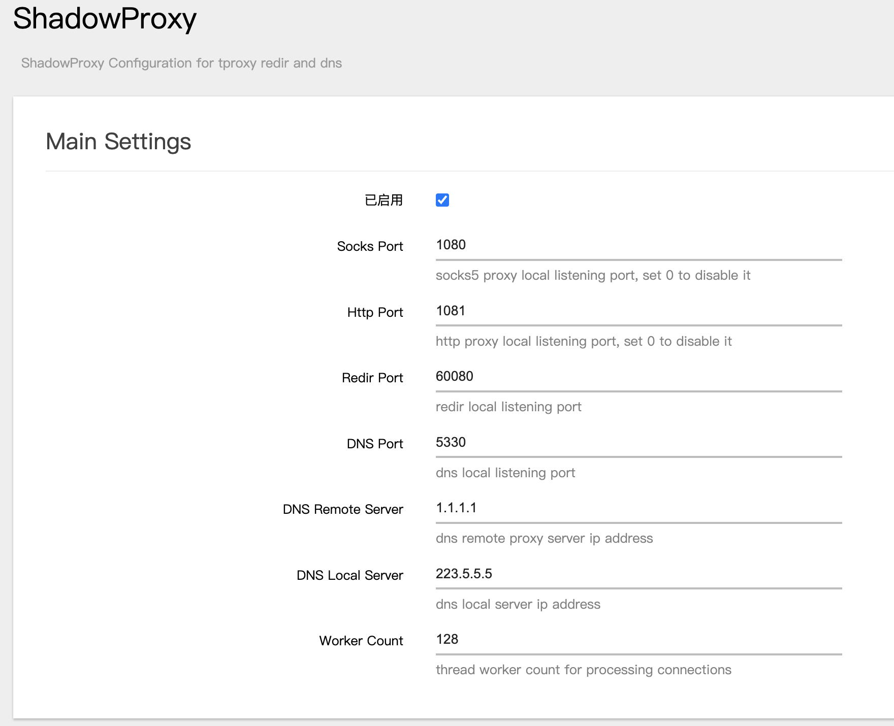
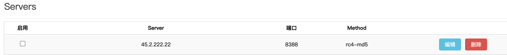

ShadowProxy - OpenWrt LuCI for Shadowsocks-Rust
===

Introduction
---

It supports to configure shadowsocks-rust tproxy(redir) and dns acl on openwrt, with LuCI interface.

Wish it helps.

In main setting, it is better to set your local dns server, which could be found in `/tmp/resolve.conf.ppp` or `/tmp/resolv.conf.d/resolv.conf.auto`.

Add your shadowsocks servers in the server section. It's better to configure both ipv4 and ipv6 for one same server together. It will check which ip route is better to reach the server. 

Dependency
---

1. `sslocal`, the executable shadowsocks-rust binary file is extracted from shadowsocks-rust releases. For convenient and security, the repo contains a `sslocal` file, which contains updated features for better network connection. If you have any security concerns, please compile from the source code with features `local-dns,local-redir,security-replay-attack-detect`.
2. `nftables` and `iptables`, now it supports only `nftables`, which requires less coding work. 

Configuration
---

All configuration files are under `/etc/shadowproxy`. A `config-template.json` file is updated by the `/etc/init.d/shadowproxy` with uci configuration from `/etc/config/shadowproxy`.

TODO
---

- [x] enable/disable service
- [x] .github action to package ipk
- [x] support to enable socks&http proxy
- [ ] ~~support plugins~~
- [ ] ~~support iptables for openwrt-21~~
- [x] support x86_64-musl platforms
- [x] support more shadowsocks-rust configurations
- [ ] support multi GFW blocked countries (any help is welcome) 

Q&A
---

1. Installed but not appears in browser
    - `rm -rf /tmp/luci-*`
    - In Chrome `Developer Tools -> Network -> Disable Cache`

2. How to install without `ipk`
    - Copy sslocal to `/usr/bin/sslocal`
    - Copy `htdocs/*` to `/www/`
    - Copy `root/*` to `/`
    - `/etc/init.d/shadowproxy enable`

3. First time configuration (bug to fix)
    - The `/etc/init.d/shadowproxy` will config `dnsmasq` server automatically. If you did not set the correct server, you may not be able to reach network, because no dns server available. Configure your server and save apply.
4. Supported Devices
   - aarch64-musl (armv8)
5. Why plugins are not suggested?
   - the plugins support in shadowsocks-rust, it starts another child process to auto proxy packets. which consumes hardware resources. And in such case, it is recommended that using v2ray or clash directly. 
6. What is `err_cert_common_name_invalid`
   - It caused by the ipv4 and ipv6 rotate changes. When it has dns cache in transparent proxy, which could be resolved as ipv6 address. However, the proxy server accesses the address with ipv4 outbound interface. It crashes. 
   - And, if it does not resolve, restart the dnsmasq to clear the dns cache.
7. How to support openwrt-21
   - Check the [openwrt nftables doc](https://openwrt.org/docs/guide-user/firewall/misc/nftables)
   - opkg update && opkg install nftables kmod-nft-tproxy
8. How to set up shadowsocks-rust server
   - the x86-64 gnu file `ssserver` is also supplied.  
9. How to support other countries?
   - Change the ip set in `chnip4.ips` and `chnip6.ips`, by default, no update is required for `shadowproxy-dns-base.acl`, and redir will proxy all data. Any PR is welcome
